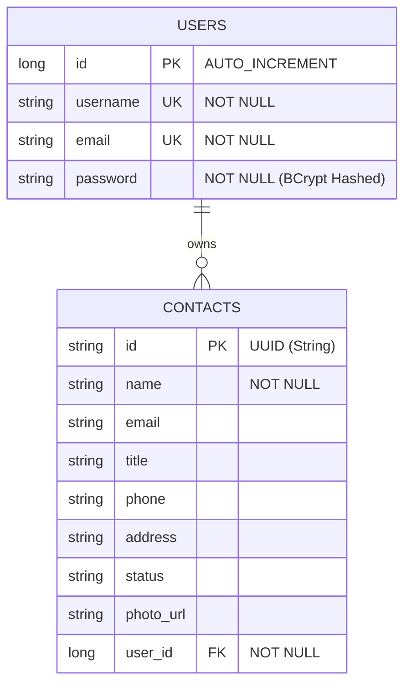

# 📱 Contact Manager (Full-Stack application)

[](https://spring.io/projects/spring-boot)
[](https://react.dev/)
[](https://www.mysql.com/)
[](https://jwt.io/)
[](https://vitejs.dev/)
[](https://opensource.org/licenses/MIT)

A robust, modern, and secure full-stack **Contact Management System** that allows users to register, log in, and securely manage their contacts. The application is built with a decoupled architecture featuring a **Spring Boot REST API** backed by a **MySQL Database**, and a highly-responsive **React Single-Page Application (SPA)** built using **Vite**.

---

## 🌟 Key Features

### 🛡️ Authentication & Authorization
* **JWT-Based Stateless Sessions**: Secure access using JSON Web Tokens (JJWT 0.12.5).
* **Password Hashing**: BCrypt hashing for secure password storage.
* **Granular Protection**: Restricts API operations to authorized users only.

### 👤 Contact Management (User-Isolated)
* **CRUD Operations**: Secure creation, retrieval, updates, and deletion of contact data.
* **Data Isolation**: Users can only see, edit, or delete their *own* contacts.
* **Pagination & Sorting**: Fast retrieval using Spring Data JPA pagination (`PageRequest` with sorting by name).
* **Profile Image Uploads**: Dynamic file storage on local directory and retrieving through public static content streaming.

### 💻 Client Experience (React + Vite)
* **Protected Routes**: Navigation guards (`ProtectedRoute.jsx`) to enforce authentication.
* **Modern UI Layout**: Responsive design with clean custom CSS and modal interaction.
* **Toasts Notifications**: Live updates with `react-toastify`.
* **Axios Interceptors**: Auto-injects bearer token to headers of all outgoing API requests.

---

## 📐 Architecture & Database Model

The database is built on **MySQL** with automatic schema generation. Below is the relationship between the `User` entity and the `Contact` entity:



* **One-to-Many Relationship**: Each user can own multiple contacts (`@ManyToOne` mapping with Lazy loading configuration in the `Contact` entity).
* **Cascade deletion handling**: When a contact is deleted, the server automatically cleans up the corresponding image file on the local machine.

---

## 🔌 API Endpoints Reference

### 1. Authentication (`/auth`)

#### Register User
* **Endpoint**: `POST /auth/register`
* **Request Body**:
  ```json
  {
    "username": "john_doe",
    "email": "john.doe@example.com",
    "password": "strongpassword123"
  }
  ```
* **Responses**:
  * `200 OK`: `"User registered successfully!"`
  * `400 Bad Request`: `"Error: Username is already taken!"` or `"Error: Email is already in use!"`

#### Login User
* **Endpoint**: `POST /auth/login`
* **Request Body**:
  ```json
  {
    "username": "john_doe",
    "password": "strongpassword123"
  }
  ```
* **Responses**:
  * `200 OK`:
    ```json
    {
      "token": "eyJhbGciOiJIUzI1NiIsInR5cCI6IkpXVCJ9...",
      "username": "john_doe"
    }
    ```

---

### 2. Contacts Management (`/contacts`)
> [!IMPORTANT]
> All endpoints below require the `Authorization` header with a valid JWT token:
> `Authorization: Bearer <your_jwt_token>`

#### Create / Save Contact
* **Endpoint**: `POST /contacts`
* **Request Body**:
  ```json
  {
    "name": "Jane Smith",
    "email": "jane.smith@example.com",
    "title": "Software Engineer",
    "phone": "+1 234 567 890",
    "address": "123 Dev Lane, Tech City",
    "status": "Active"
  }
  ```
* **Response**: `201 Created` with the full saved entity including its generated UUID string.

#### Get Paginated Contacts
* **Endpoint**: `GET /contacts?page={page}&size={size}`
* **Query Parameters**:
  * `page` (optional, default: `0`): Page index.
  * `size` (optional, default: `10`): Number of records per page.
* **Response**: `200 OK` with JSON Page structure containing elements sorted by `name` alphabetically.

#### Get Contact by ID
* **Endpoint**: `GET /contacts/{id}`
* **Response**: `200 OK` with Contact details.

#### Update Profile Image
* **Endpoint**: `PUT /contacts/photo`
* **Content-Type**: `multipart/form-data`
* **Request Parameters**:
  * `id`: The UUID of the contact.
  * `file`: The multipart file upload (image format).
* **Response**: `200 OK` returning the string URL pointing to the static resource endpoint.

#### View Profile Image (Public)
* **Endpoint**: `GET /contacts/image/{filename}`
* **Response**: `200 OK` returning byte stream representing image (`IMAGE_JPEG`, `IMAGE_PNG`, `IMAGE_GIF`).

#### Delete Contact
* **Endpoint**: `DELETE /contacts/{id}`
* **Response**: `200 OK`:
  ```json
  {
    "message": "Contact Deleted Successfully!!"
  }
  ```

---

## 🛠️ Installation & Setup

### Prerequisites
* **Java Development Kit (JDK)**: version 21
* **Node.js**: version 18+ (with npm)
* **MySQL Database Service**

---

### Step 1: Backend Setup (Spring Boot)

1. **Navigate to the Backend Directory**:
   ```bash
   cd "ContactApi backend"
   ```

2. **Configure Database & Directory**:
   Create a schema named `contact_api` in your local MySQL instance. Open [application.yml](file:///d:/Coding_Gita/SpringBoot/contacts-manager/ContactApi%20backend/src/main/resources/application.yml) and change credentials if they differ:
   ```yaml
   spring:
     datasource:
       url: jdbc:mysql://127.0.0.1:3306/contact_api?useSSL=false
       username: <your_username>
       password: <your_password>
   ```

   > [!NOTE]
   > The application stores contact images locally in `<user_home>/Downloads/uploads/` by default. This folder is created automatically during the first photo upload.

3. **Build & Run**:
   Use the Maven wrapper to build and start the application:
   ```bash
   # On Windows (cmd/Powershell):
   .\mvnw spring-boot:run
   
   # On macOS/Linux:
   chmod +x mvnw
   ./mvnw spring-boot:run
   ```
   The backend server will launch on `http://localhost:8080`.

---

### Step 2: Frontend Setup (React + Vite)

1. **Navigate to the Frontend Directory**:
   ```bash
   cd "contactapp frontend"
   ```

2. **Install Dependencies**:
   ```bash
   npm install
   ```

3. **Run the Development Server**:
   ```bash
   npm run dev
   ```
   The frontend application will spin up at `http://localhost:5173`. Open this URL in your browser to access the dashboard!

---

## 🏗️ Codebase Directory Structure

```text
contacts-manager/
├── ContactApi backend/          # Spring Boot Application
│   ├── src/main/java/.../
│   │   ├── config/              # Security config, JWT filters
│   │   ├── controllers/         # REST API endpoints (Auth & Contacts)
│   │   ├── domain/              # JPA Entities & DTOs (User, Contact, AuthDto)
│   │   ├── repository/          # Spring Data JPA Interfaces
│   │   └── services/            # Business Service Layer (Contact, Users)
│   ├── src/main/resources/
│   │   └── application.yml      # Configuration properties
│   └── pom.xml                  # Maven Dependency File
│
├── contactapp frontend/         # React SPA (Vite)
│   ├── src/
│   │   ├── api/                 # Axios clients (AuthService, ContactService)
│   │   ├── components/          # Reusable components & Pages
│   │   ├── App.jsx              # Routes & Global State
│   │   ├── index.css            # Stylesheets
│   │   └── main.jsx             # React entry point
│   ├── package.json             # NPM dependencies
│   └── vite.config.js           # Vite build configurations
```

---

## 🔒 Security Configuration Notes
The application features a robust CORS policy setup in `SecurityConfig.java` to allow secure cross-origin requests from the React application:
* Allowed origins by default: `http://localhost:5173`, `http://localhost:5174`, `http://localhost:5175`, and `http://localhost:4200`.
* Exposed Headers include `Authorization` to permit receipt of JWT tokens from backend headers.

---

## 📝 License
This project is licensed under the MIT License - see the LICENSE file for details.
